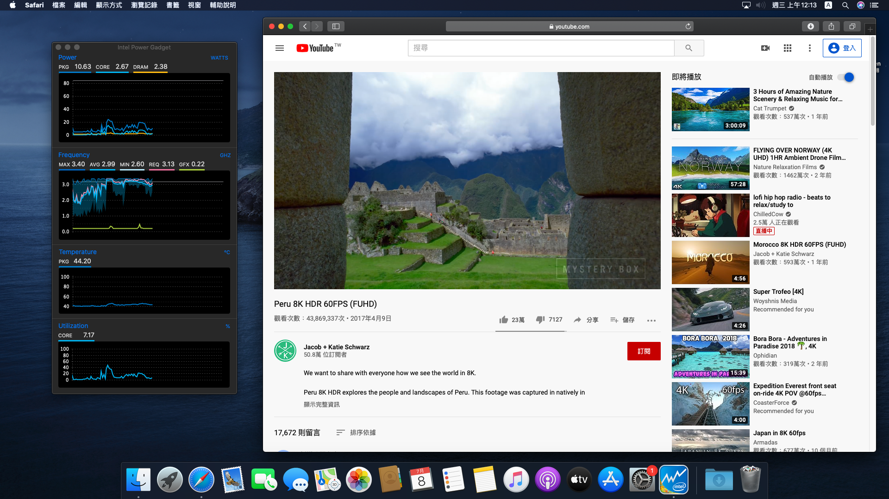
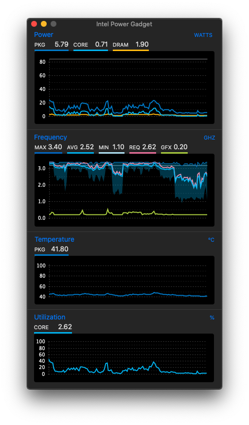
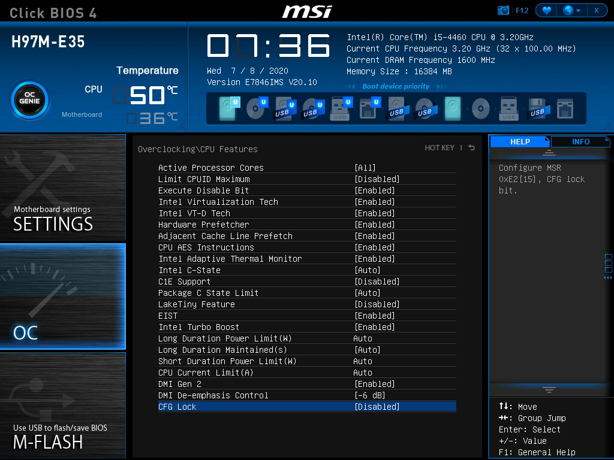
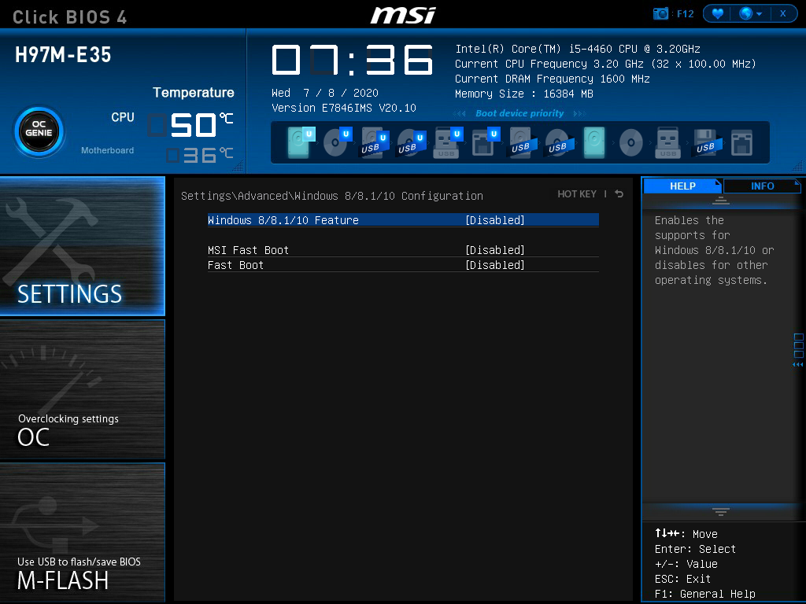
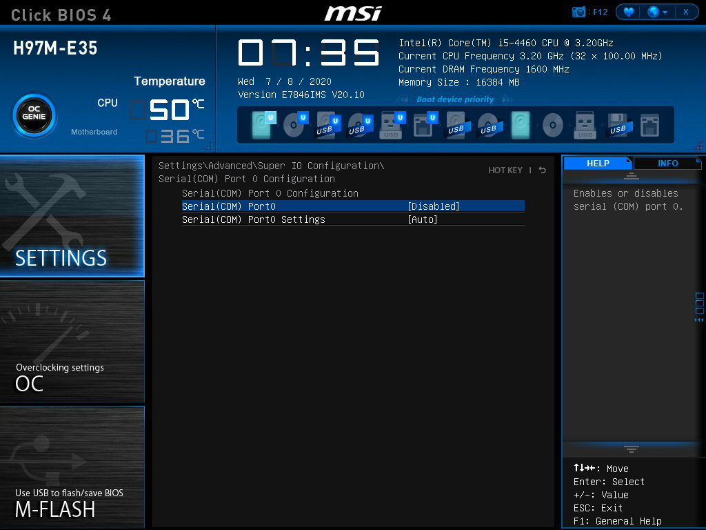
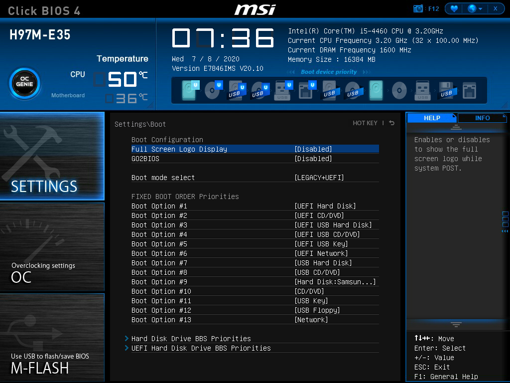

# Hackintosh for H97-E35 | Intel i5-4460

Thanks for [OpenCore Desktop Guide](https://dortania.github.io/OpenCore-Desktop-Guide/config.plist/haswell.html)

---
### Parts List
Type|Item
:----|:----
**CPU** | Intel - Core i5-4460 3.2 GHz 4-Core Processor
**Motherboard** | Msi - H97M-E35
**Memory** | ADATA DDR3-1600 (8G*2)
**Storage SATA III (for MacOS)** | Samsung 860 EVO 250 GB SATA 2.5 Inch Internal Solid State Drive (SSD) (MZ-76E250)
**Power Supply** | FSP AURUM 92+ 450W 80Plus Semi Modular ATX Power Supply (PT-450M)
---
#### Working
* Catalina 10.15.3 install and boots successfully
* APFS
* iGPU HD6400
* Wired Ethernet - Realtek® RTL8111G Gigabit
* Onboard Audio - Realtek®  ALC887
* USB 2.0, USB 3.0
* Sleep/Wake
* Quicklook
* Youtube video
* Facetime
* iMessage
* App Store
* Intel HWP
---
### Bugs
* Can't wake up by mouse
---
### Install
1. Check the configuration in BIOS.
2. Build your install usb drive, and replace the EFI my release.
---
### Screenshot
* HWP
  

* BIOS Configuration

- SerialIO will cause black screen after wake up.

